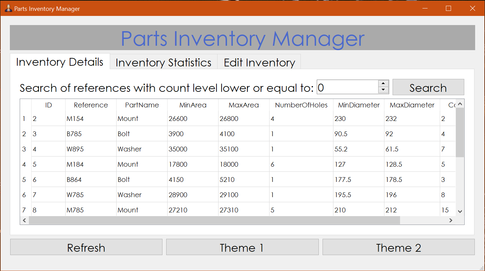

# udemy_inventory-management
Example of an inventory management software made with PySide2 that displays data from an SQLite database. 

This project is part of a Udemy course, [Build Real Software with Python, PyQt5 and QT Designer](https://www.udemy.com/course/python-pyqt5/)

