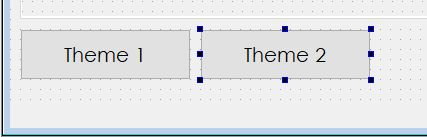
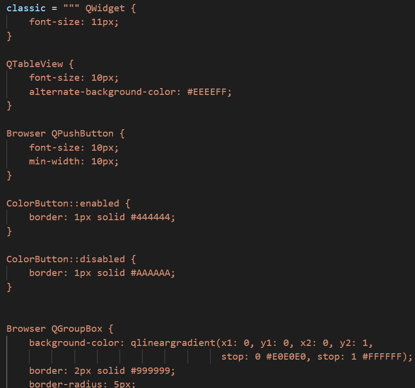
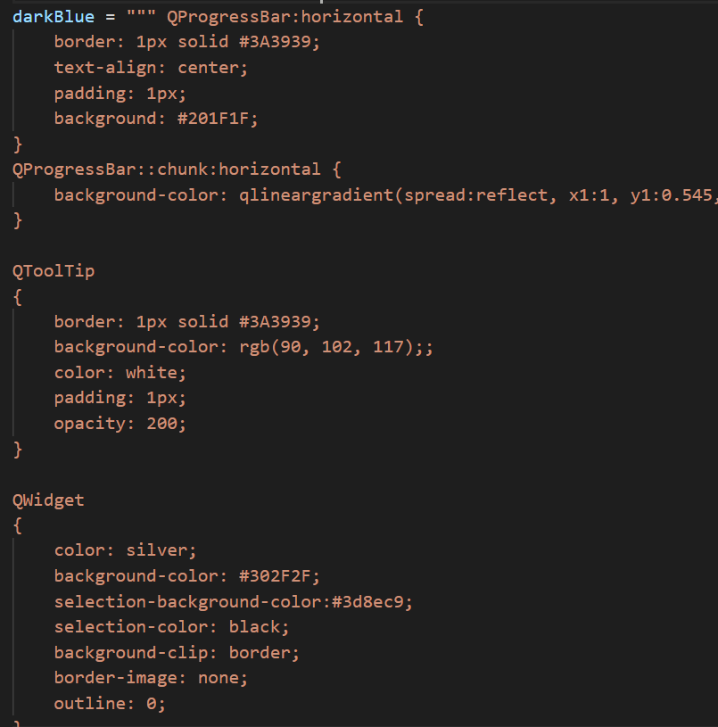
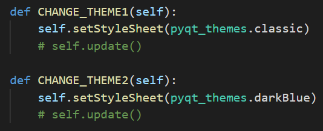
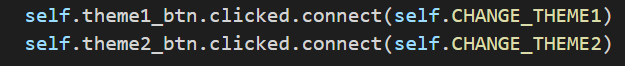

# Conditional change of Widget Style using Python Code

Add 2 buttons to your window call them "Theme 1" & "Theme 2".

Create a python file (mine is called pyqt_theme.py) that has themes in it.

Import your theme file into your PyQT file.

    import pyqt_themes.py

Next, add the functions that will change the style sheet to the Main class.

Finally, link the two theme buttons to the two theme functions.

